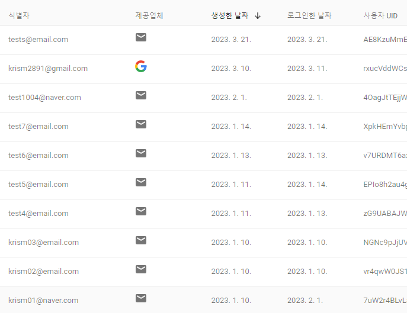
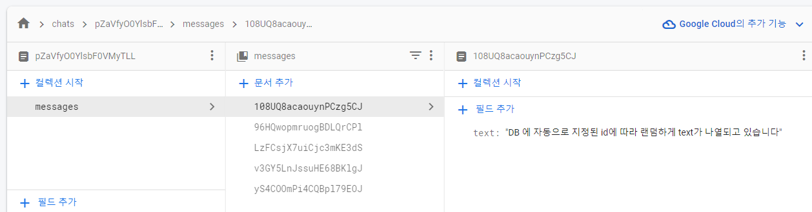

## 결과물

### firebase_authentication

### firestore

### 흐름
흐름:
1. 회원가입
2. 일반 로그인
3. 채팅앱 보여주기 
4. 로그아웃 후, 구글 로그인 후, 채팅앱 보여주기

### 화면 구성
1. Signup 클릭하여 회원가입 성공하면 Login 을 진행할 수 있다
 - 테스트 계정 id: tests@email.com, password: 123456 
2. Login 에 성공하면 한개의 채팅방에서 서로 채팅을 할 수 있다
 - 단, 유저를 구분하고 있지 않으므로, 누구의 채팅인지 알 수 없는 상태이다 

### 특징
1. main 에서 StreamBuilder 에서 authStateChanges 으로 토큰유무 체크하고 진행하는게 특징
2. 회원가입 & 로그인 페이지에서 body: ModalProgressHUD() 설정하는게 특징
3. 제일 처음으로 돌아가기: Navigator.of(context).popUntil((route) => route.isFirst);
4. 회원탈퇴: FirebaseAuth.instance.currentUser!.delete();

### 개선할 점
1. [v] 버튼 클릭 시, unfocus() 실행하여 소프트 키보드 해제하기
2. [v] 회원가입의 password 입력창 클릭 시, 소프트키보드에 입력창이 가려지는 현상 수정
   - padding: EdgeInsets.only(bottom: MediaQuery.of(context).viewInsets.bottom * 1)
3. [v] 구글로그인 구현
4. [] 로그아웃 시, Null check operator used on a null value 에러 발생 (기능 문제는 없다)
   - 화면 오류나는 부분이 없으니 찾기 힘듦
5. [] signup_signin 페이지 리펙토링 하기
* [] 직접 firebase 에 접근하여 데이터를 작성하였는데, 코드를 통해 메시지를 생성하기