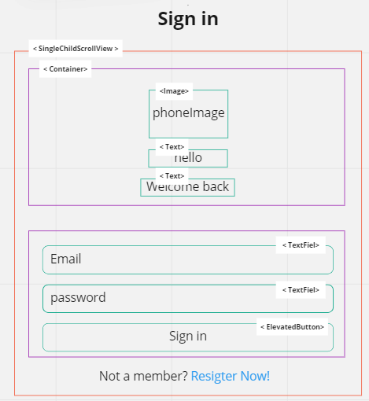
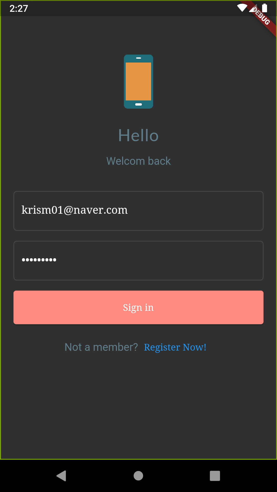
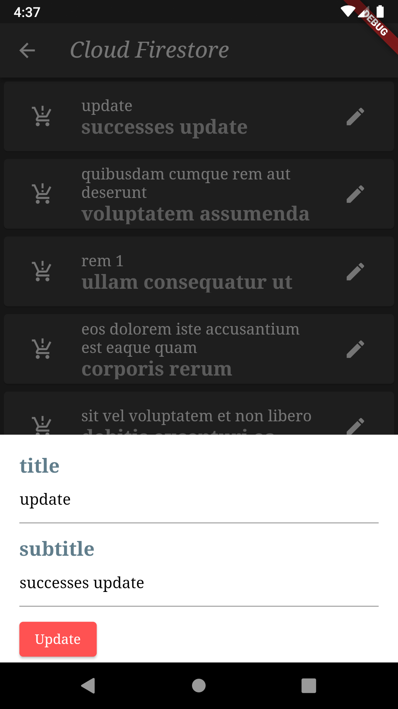
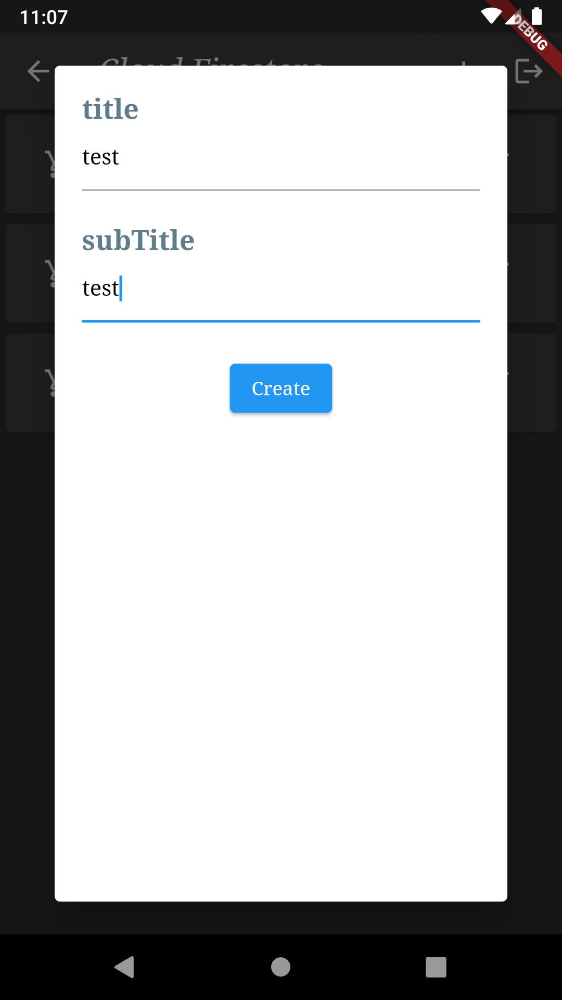
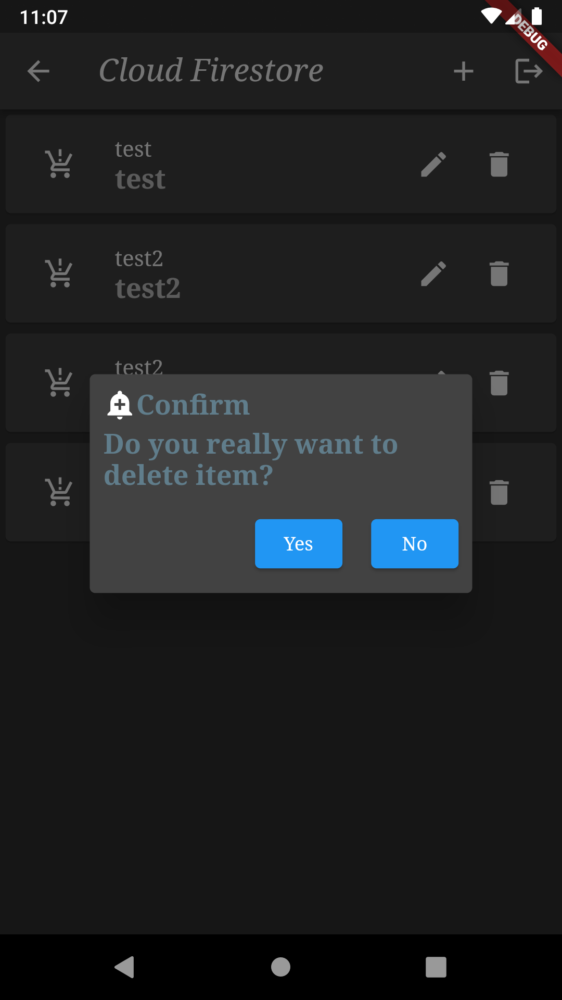

### 원본 design

### signin layout

### login 결과 

### update

### create

### delete

### 과정
    1. [v] 초기화면 만들기
    2. [v] TextField 만들기
    3. [v] Sign in 기능 만들기
    4. [v] 로그인 시, products 전체 목록 나타내기
     - Firestore DB - posts 컬렉션 접근
    5. [v] 우측 핸폰 클릭 시, 상세 정보 나타내기
    6. [v] update 구현하기
     1) 로그인 시, ModalProgressHUD 로딩 기능 구현
     2) 화면에 잘리는 부분 방지하기 위한 SafeArea 설정 
    7. [v] create 구현하기
    8. [v] delete 구현하기
    * [] Sign up 기능 만들기
